# Dataset Analysis

## Summary
The dataset you have described encompasses a wide range of information related to books and their readers on Goodreads. With 10,000 entries, it provides a comprehensive view of various book characteristics, reader ratings, and author contributions. Here’s an analysis of the data, along with some insights and implications that can be drawn from it:

### Dataset Overview

1. **Basic Book Information**:
   - Each book is uniquely identified by multiple IDs (`book_id`, `goodreads_book_id`, `best_book_id`, `work_id`).
   - The `books_count` column, with a mean of ~75, suggests that many entries are part of a series or related works, indicating a possible trend of readers seeking broader narratives or interconnected stories.

2. **Publication Year Trends**:
   - The `original_publication_year` has a mean of about 1982, with a minimum value of -1750. This spike in originality might point to a few misclassified entries but, overall, suggests that the dataset includes both contemporary and classic literature. The latest book published included in the dataset is from 2017.

3. **Authors**:
   - The variable `authors` shows a lack of missing values, indicating that all entries successfully reference authors. This could help in further analyses regarding author popularity or productivity.

4. **ISBN Information**:
   - There are notable missing values in the `isbn` and `isbn13` fields (700 and 585 missing values respectively), which could affect sales tracking and bibliographic data.

5. **Language Codes**:
   - A significant number of entries (1084) also lack a `language_code`. This could impact studies on linguistic diversity among books or the global reach of different authors.

6. **Ratings and Reviews**:
   - The metrics for ratings (`ratings_count`, `average_rating`, `work_ratings_count`) indicate that overall reader engagement is substantial. The average rating of 4.00/5 is impressive, suggesting that readers generally enjoy the books in the dataset.
   - The data about ratings distribution (`ratings_1` to `ratings_5`) shows that while there are significant counts for each, a heavy skew appears towards the higher ratings, particularly in ratings of 4 and 5. This suggests that readers predominantly rate positively, which may result from skewed reader demographics or a self-selection bias where only favored books are reviewed.

### Insights and Implications

1. **Reader Preferences**:
   - With a favorable average rating, it appears that the dataset captures a well-received selection of books. This suggests that publishers or bookstores could leverage this data to promote similar high-rated titles, possibly even considering marketing campaigns focused on series or authors with high `books_count`.

2. **Curation Opportunities**:
   - With many books having ratings counts over 10,000 and average ratings consistently above 4.0, a curated list of highly rated books could significantly benefit readers looking for recommendations. Interactive platforms could utilize this data to develop personalized reading suggestions.

3. **Publishing Trends**:
   - The presence of both classics and recent publications suggests an enduring reader interest in historical as well as contemporary works. Publishers and marketers can analyze trends in reader preferences over time to adjust publication strategies, focusing on works that have consistently received positive feedback.

4. **Addressing Missing Values**:
   - Missing data in ISBNs and language codes might hinder certain analyses. Implementing data enrichment strategies could fill these gaps, whether through external databases or further inquiries with publishers.

5. **Potential for Further Analysis**:
   - There is an opportunity to investigate the relationship between `average_rating` and `work_text_reviews_count`. Understanding whether higher ratings correlate with more reviews could influence how books are marketed, possibly prioritizing reader engagement and building community around certain titles.

### Conclusion

The analysis of this dataset reveals a rich universe of reader engagement and preferences. The high average rating combined with substantial discrepancies in missing values suggests a focused effort on quality over quantity for the books included. For stakeholders in the publishing industry, libraries, or educational institutions, leveraging this information could lead to better strategic decisions and enhanced reader experiences.

## Visualizations

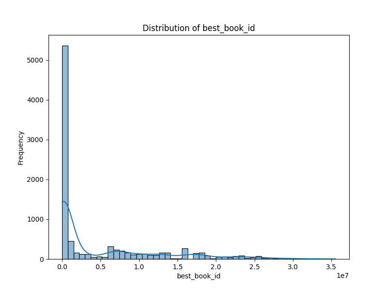
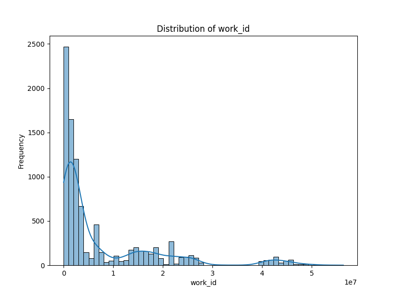
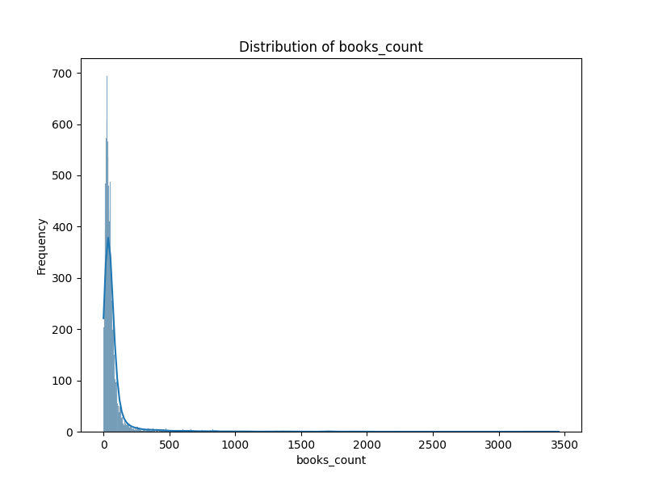

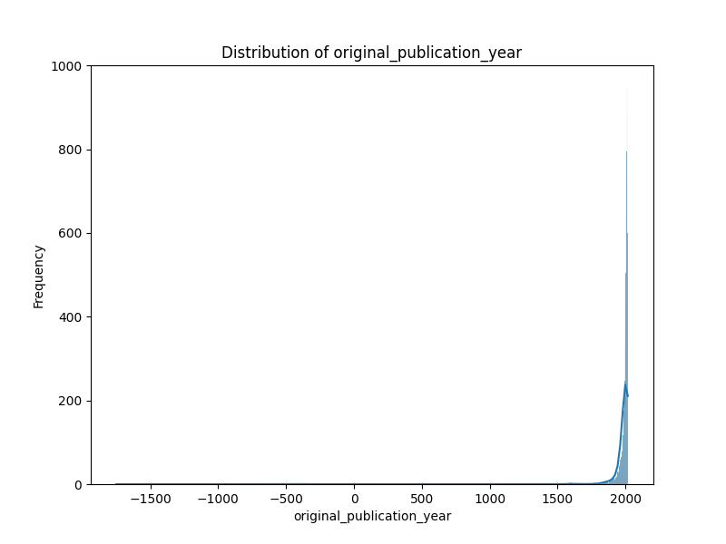
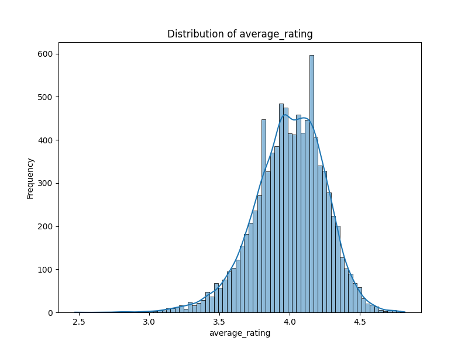

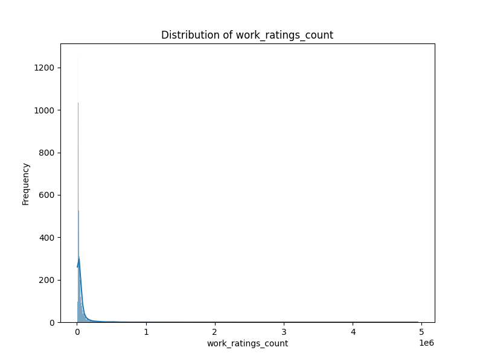
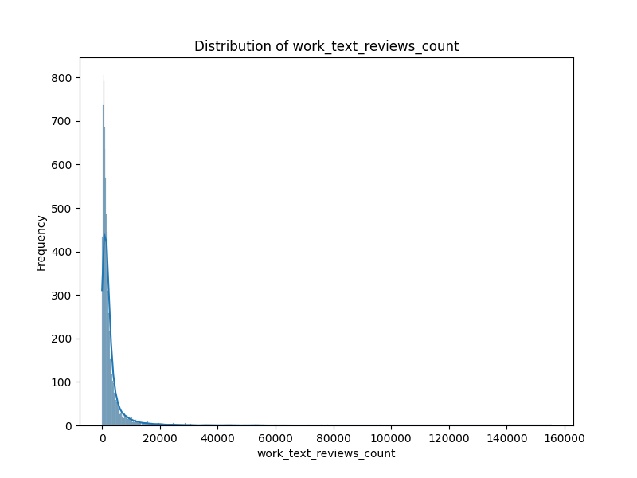
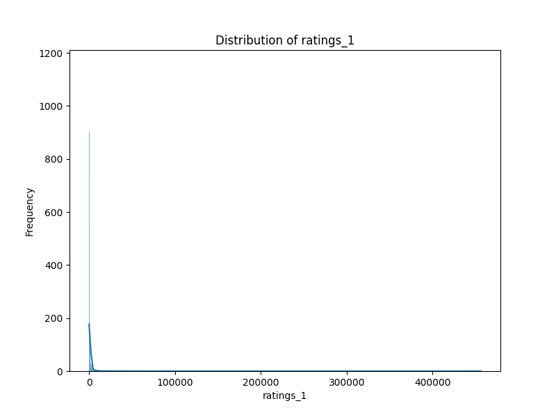
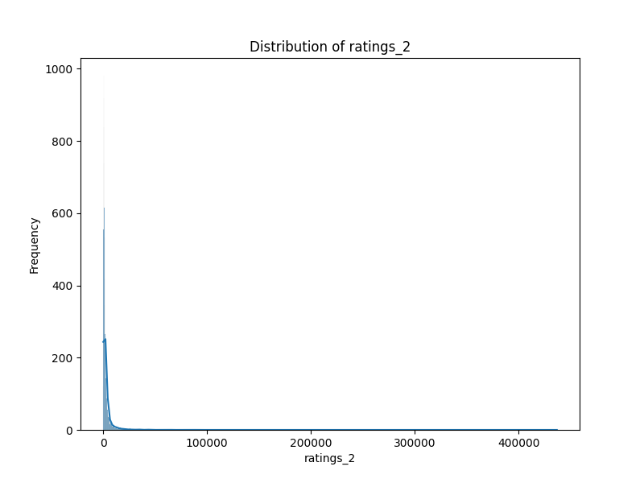
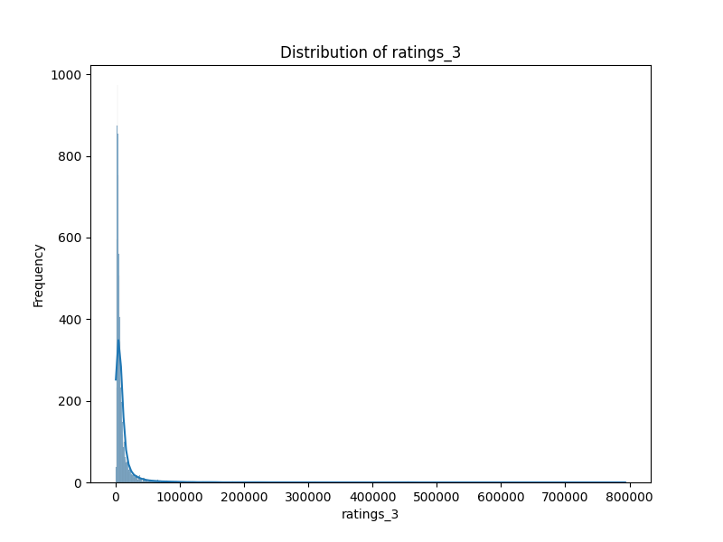
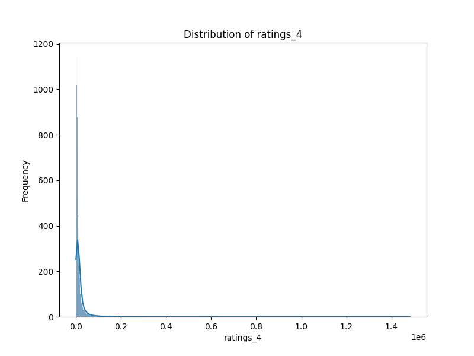
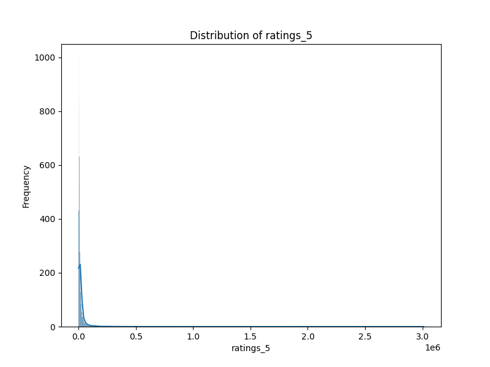

