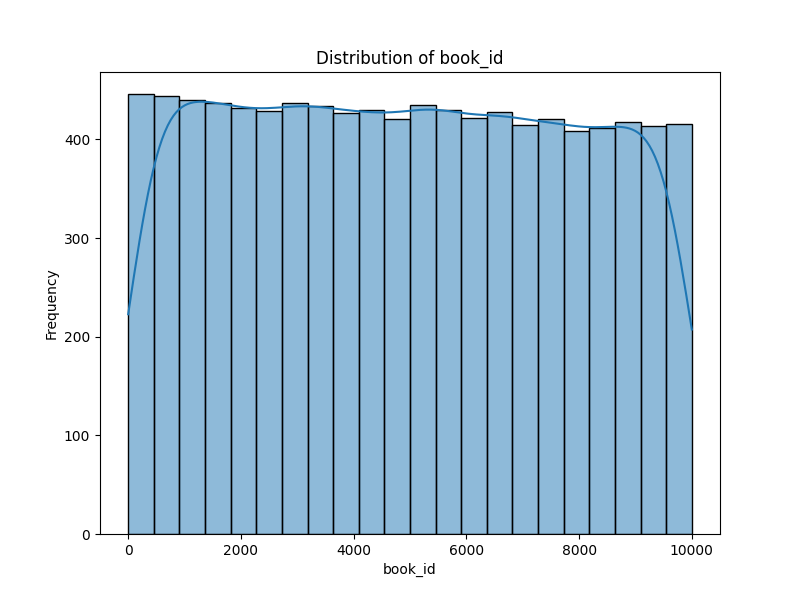
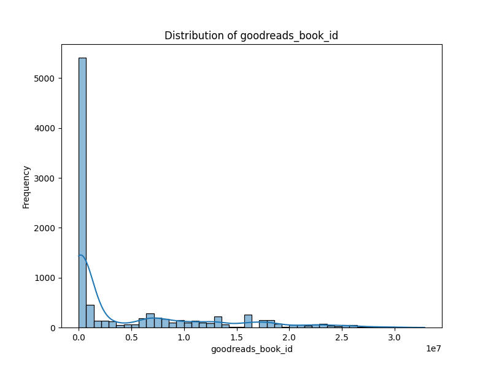
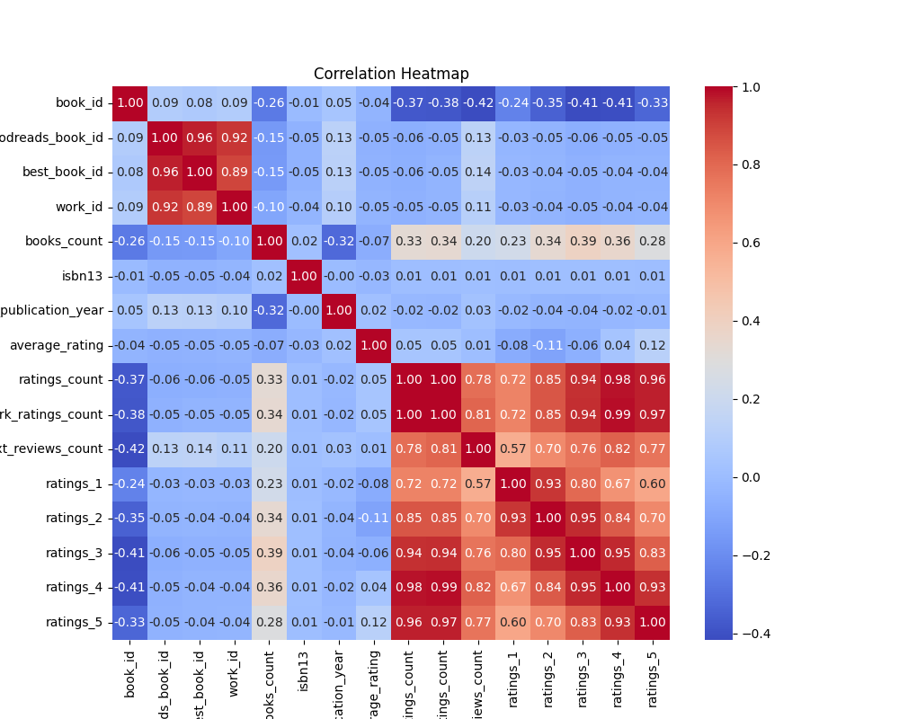

# Dataset Analysis

## Summary
Based on the dataset and summary statistics you have provided, a number of insights and implications can be drawn regarding the collection of books you're analyzing. Here’s a structured approach that combines analysis, storytelling, and potential implications:

### Overview of the Dataset

The dataset contains information on 10,000 books, with various attributes related to their ratings, authorship, publication year, and other relevant identifiers. The presence of missing values in some key fields presents challenges that will need to be addressed for a comprehensive analysis.

### Key Insights from Summary Statistics

1. **Diversity of Books**:
   - **Books Count**: The average number of books attributed to each author is about 76, indicating a vast diversity in authorship. Authors who contribute significantly to the number of books can be considered prolific within their genres.

2. **Publication Trends**:
   - **Original Publication Year**: The mean publication year is around 1982, with a range that extends back to 1750 and up to 2017. This suggests a wide temporal range of books being considered, indicating both historical classics and contemporary literature are present in the dataset.

3. **Rating Distribution**:
   - **Average Rating**: The average rating across books is around 4.00 on a 5-point scale, with a relatively low standard deviation (0.25), pointing to a general consensus on the quality of books in this dataset. The minimum rating recorded is 2.47, which implies that while a majority of books are well-received, a few have garnered notably lower scores.
   - **Ratings Count**: With an average ratings count of over 54,000, many books are popular amongst readers, suggesting a healthy level of engagement, though the standard deviation indicates significant variability in how many ratings different books have received.

4. **Missing Values**:
   - Missing data in fields like `isbn` (700 missing), `isbn13` (585 missing), and `original_title` (585 missing) suggests that data quality may be an issue. More importantly, the 1084 missing entries in `language_code` are particularly concerning, as they limit the ability to analyze books by language, which is crucial for understanding cultural insights and trends. 

### Narrative Implications

#### The Growth of Diverse Literature

The dataset paints a positive picture of literary engagement over time. With an average rating that hovers around 4.00, it reinforces the idea that readers are gravitating towards quality literature. Emerging authors and classic favorites not only coexist but often find appreciation among the same readership. This diversity offers opportunities for various marketing strategies, from promoting classic literature anthologies to spotlighting new authors who deserve attention.

#### The Challenge of Data Quality

The presence of numerous missing values calls for a critical re-evaluation of data collection practices. The absence of ISBNs and information about language can hinder the ability to draw more nuanced conclusions about trends and reader preferences. Filling in these gaps could yield insights into authorship trends based on language or publication logistics that contribute toward strategies for promoting books based on language diversity.

#### Genre and Author Insights

The average `books_count` indicates that many of these authors may straddle multiple genres or series, showing that reader loyalty doesn't just represent a single book but extends to an entire body of work. Further analysis could delve into genre classification, offering insights on which genres are performing well and how reader preferences may shift over time.

### Concluding Thoughts

This analysis leads us to understand both the strengths and weaknesses within the dataset. The apparent popularity and high ratings of the books suggest a thriving literary culture, while the issues with missing data highlight a need for more rigorous data collection and management. Addressing these challenges will empower more targeted marketing efforts, deepen engagement with readers, and ultimately enhance the quality of literary offerings available in the marketplace.

Investing in improving the dataset will not only elevate the analysis potential but also enable stakeholders—be it publishers, libraries, or authors—to make informed decisions that can amplify the reach and impact of literature.

## Visualizations

