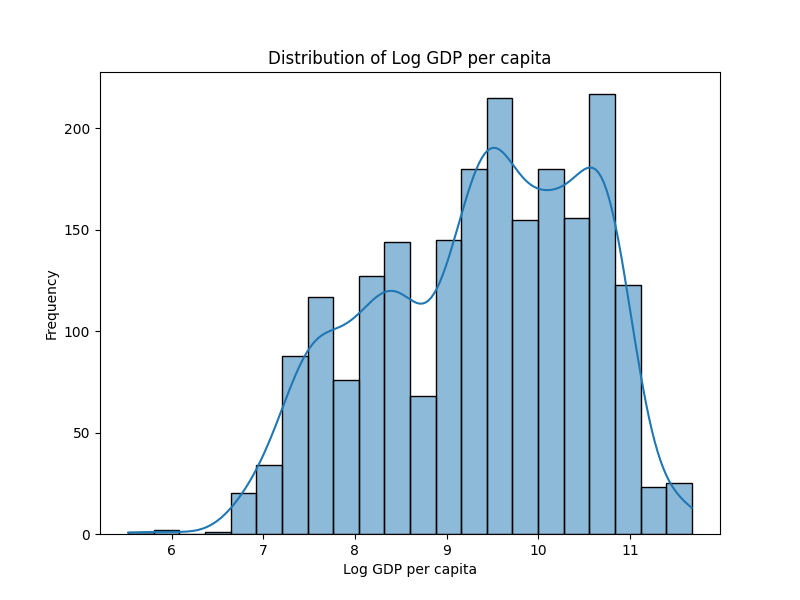
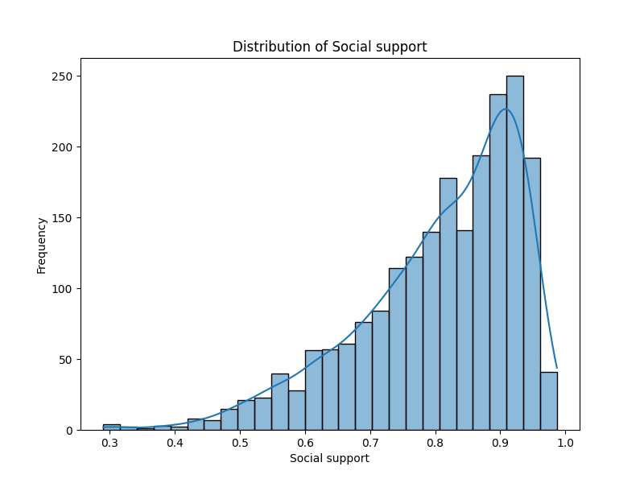
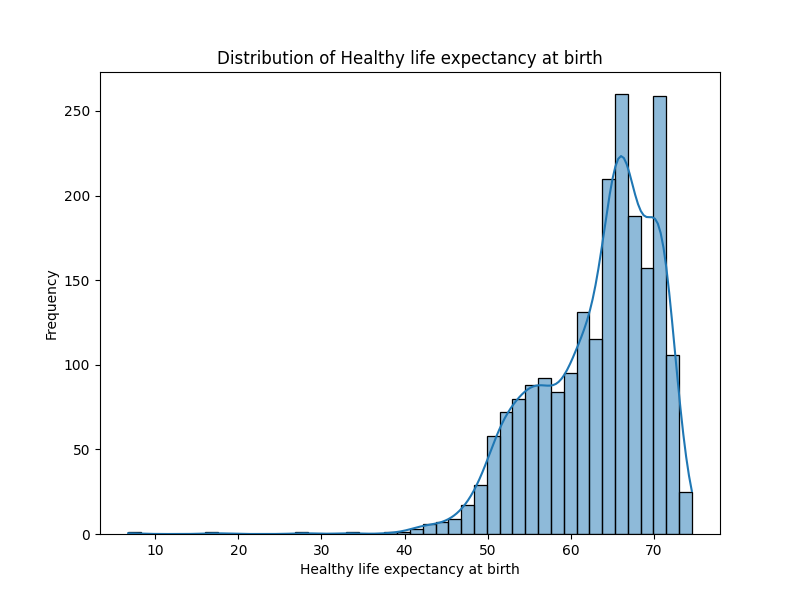
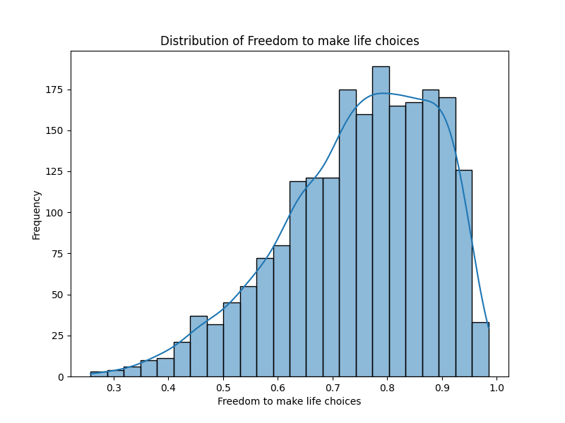
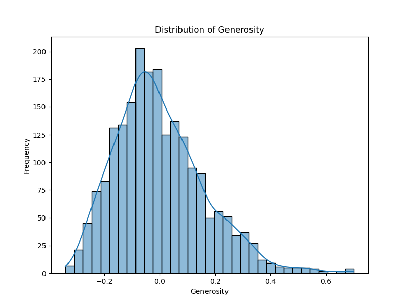
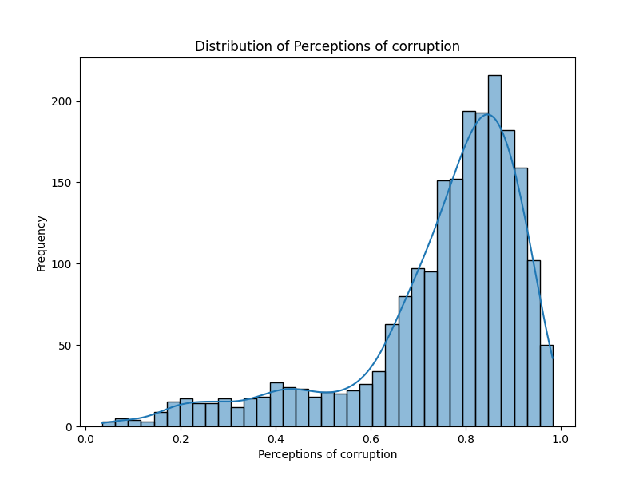
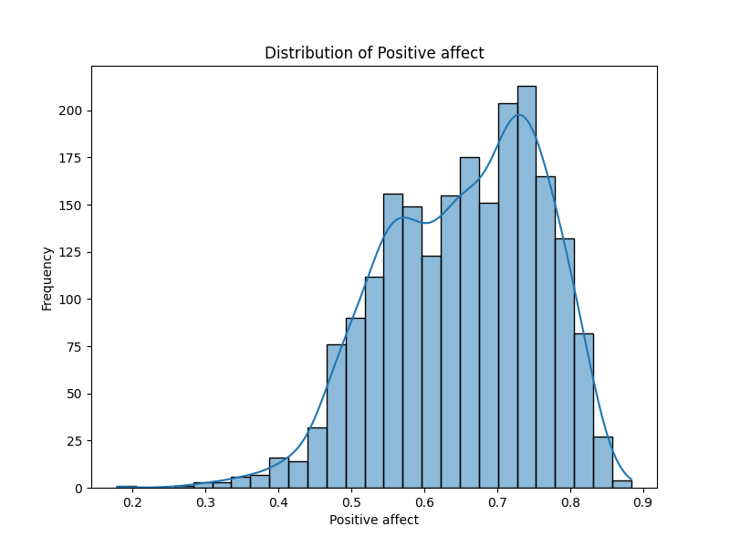
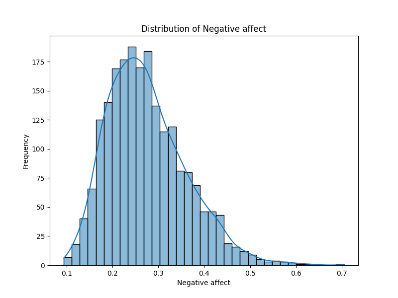

# Dataset Analysis

## Summary
### Analysis and Insights from the Dataset

This dataset comprises socioeconomic indicators from various countries over time, specifically focusing on factors that contribute to subjective well-being (captured through the "Life Ladder" score) and other relevant metrics like GDP, social support, health, freedom, and perceived corruption. Let's delve into the insights derived from the statistical summaries and missing data.

#### Descriptive Statistics Insights

1. **Life Ladder Scores**:
   - The average Life Ladder score is **5.48** (with a maximum of **8.019** and a minimum of **1.281**). This implies a wide range of perceived happiness and life satisfaction across different countries.
   - The standard deviation of **1.13** indicates significant variability, suggesting that while some countries are faring well, others are experiencing quite low levels of life satisfaction.

2. **Economic Indicators (Log GDP per Capita)**:
   - The average Log GDP per Capita is approximately **9.40**, reflecting varying economic prosperity.
   - With a standard deviation of around **1.15**, the gap between the richest and poorest economies is noteworthy, as evidenced by the maximum value of **11.676** versus a minimum of **5.527**.

3. **Social Support**:
   - The mean Social Support score is **0.81**, suggesting that, on average, people feel they have access to supportive relationships. However, the range (from **0.228** to **0.987**) indicates disparities in community support across nations.
   - Higher levels of social support are often associated with enhanced life satisfaction, so improvements in this area could positively affect the Life Ladder scores.

4. **Health (Healthy Life Expectancy)**:
   - The average life expectancy at birth is **63.40 years**, with a max of **74.6 years** indicating a substantial difference in health outcomes amongst countries.
   - A more detailed analysis could correlate this with other indicators to explore direct impacts on life satisfaction.

5. **Freedom and Corruption**:
   - High average scores (about **0.75** for freedom) suggest that people in many countries feel they have the autonomy to make life choices. Yet, the maximum, at **0.985**, shows that there are outliers with exceptionally high freedom levels, while the minimum indicates that some individuals feel greatly restricted.
   - Perception of corruption averages at **0.74**, indicating a generally positive perception of governance in many countries, even though there are stark disparities. 

6. **Affect Scores**:
   - Positive affect has an average of **0.65** whereas negative affect stands at **0.27**. This suggests that, on average, individuals report feeling more positive than negative, but the accrued difference indicates that having a low negative affect does not universally equate to high positive affect, leaving a gap for improvement in subjective well-being.

#### Missing Values Insights

- While some variables like "Country name," "year," and "Life Ladder" show no missing values, others indicate areas for improvement:
  - **Significant amounts of missing data** are seen in "Generosity" (81), which may limit understanding of how philanthropy correlates with life satisfaction.
  - "Freedom to make life choices" (36) and "Perceptions of corruption" (125) also show notable missing values, highlighting gaps in critical field data that could affect comprehensive analyses and policymaking.

### Story and Implications

The data calls attention to the profound disparities that exist globally regarding life satisfaction and its determinants. **Countries with higher GDP and robust social support structures tend to report better life satisfaction**, showcasing a clear link between economic prosperity and well-being.

In many regions, especially in lower GDP countries, enhancing social support frameworks, improving health outcomes, and ensuring freedom can be strategic areas for intervention. For instance, countries with lower scores in these areas may consider investing in community programs and healthcare access initiatives that bolster well-being.

The trend of missing data points in crucial areas like "Generosity" and "Perceptions of corruption" unveils a critical opportunity for researchers and policymakers to develop comprehensive surveys that fill these gaps. Understanding cultural norms surrounding generosity and the complex dynamics of public perceptions of corruption can guide governance strategies, improve citizen engagement, and reinforce trust in institutions.

Lastly, the findings emphasize that **improvements in social indicators such as social support, health, economic strength, and freedom can create a synergistic effect** that boosts life satisfaction across different populations. Combining quantitative economic growth with qualitative community development may yield substantial benefits for global happiness and well-being.

## Visualizations

