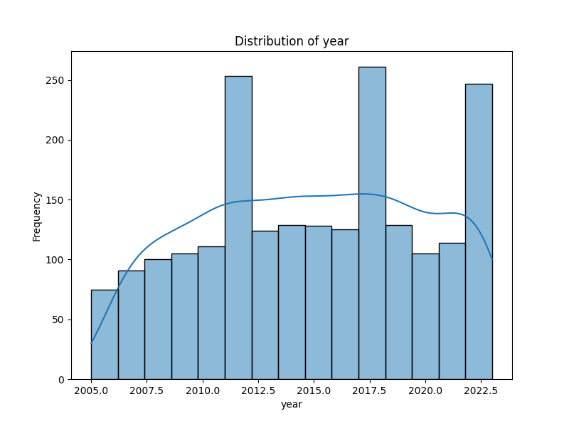
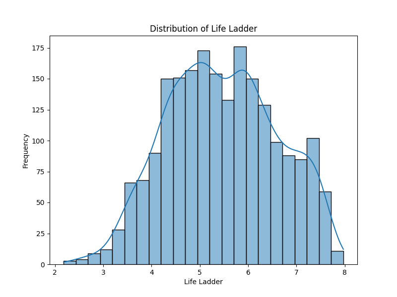
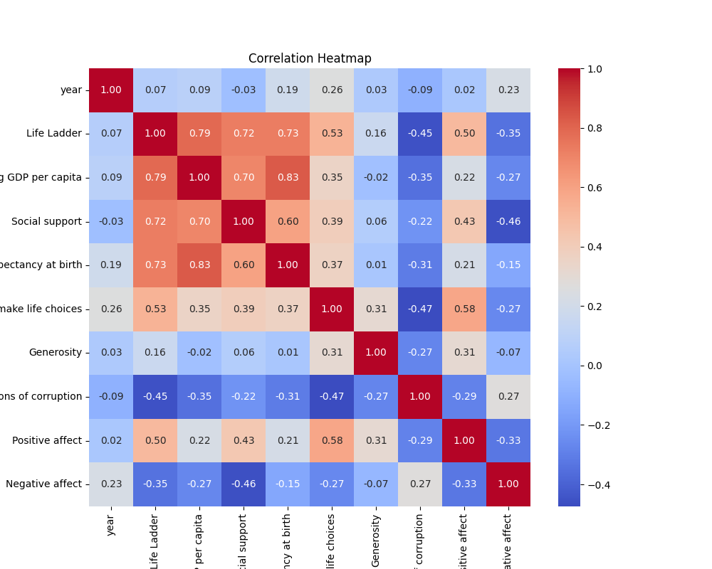

# Dataset Analysis

## Summary
## Analysis of the Dataset

### Overview

The dataset comprises various indicators that influence the subjective well-being and overall life satisfaction of individuals across different countries over time. The key variables include the Life Ladder (a measure of well-being), economic indicators (Log GDP per capita), and social factors (Social support, Freedom to make life choices, Generosity, etc.) These dimensions enable a comprehensive understanding of the factors contributing to life satisfaction.

### Summary Statistics Insights

1. **Life Ladder**: The mean Life Ladder score is approximately 5.48, suggesting that individuals generally perceive their lives positively but with room for improvement. The score ranges widely from a minimum of 1.28 to a maximum of 8.02, indicating significant disparities in well-being perceptions across different countries.

2. **Log GDP per Capita**: The average Log GDP per capita is around 9.40, which translates to a GDP per capita of approximately $12,218 (using the exponential function). The high standard deviation indicates considerable variation, with some countries benefiting significantly from higher economic output versus those that are less economically productive.

3. **Social Support**: Averaging 0.81, social support is a strong indicator of well-being. The relatively high levels signify that many individuals feel that they have support networks, although this varies significantly (minimum of 0.23).

4. **Healthy Life Expectancy at Birth**: With a mean score of 63.4 years, many individuals are expected to live healthily into their 60s, although there are instances of countries reporting life expectancies below 7 years.

5. **Freedom to Make Life Choices**: The score of 0.75 indicates that people generally feel they have the autonomy to make choices affecting their lives. However, the standard deviation indicates variability, with some individuals feeling significantly less freedom.

6. **Generosity**: The mean value for Generosity is near zero (0.0000977), suggesting that, on average, people do not tend to express high generosity, with many individuals scoring negatively.

7. **Perceptions of Corruption**: The mean score of 0.74 indicates that a majority view their governments as moderately corrupt, but noteworthy is the variation in perspectives about corruption. 

8. **Affects**: Positive affect has a mean of 0.65, while negative affect is significantly lower at approximately 0.27, suggesting a general tendency towards positivity in emotional experiences. Yet, the presence of negative affect reveals that many people still grapple with various emotional challenges.

### Missing Values

The analysis reveals notable missing data points in various columns:
- Log GDP per capita has 28 missing values, which may hinder economic evaluations in some countries.
- Healthy life expectancy and Freedom to make life choices have 63 and 36 missing entries respectively, possibly impacting assessments of health and autonomy.
- Generosity, with the highest missing values (81), raises questions about charitable behaviors and wellbeing in different regions.
- Perceptions of corruption had 125 missing entries, a crucial factor in assessing governance and societal trust.

This missing data may affect statistical power and the goodness of fit in models that could be built upon this dataset.

### Insights and Implications

1. **Economic Growth and Well-being**: The strong link between GDP per capita and Life Ladder suggests that economic growth plays a crucial role in enhancing life satisfaction. However, not all countries with high GDP report high life satisfaction. This insight underscores the necessity of addressing social welfare alongside economic growth.

2. **Role of Social Support**: The positive correlation between social support and Life Ladder highlights the importance of community ties. Programs that foster connections within communities could be beneficial, particularly in countries with lower life satisfaction scores.

3. **Autonomy and Freedom**: Greater individual freedom correlates with higher life satisfaction. Policies encouraging personal autonomy and decision-making, alongside awareness campaigns to educate citizens about their rights, may be vital in improving life perceptions.

4. **Counteracting Negative Affects**: With notable levels of negative affect reported, mental health initiatives are essential. Countries should prioritize mental health resources and awareness campaigns to reduce stigma and promote supportive environments.

5. **Generosity and Well-being**: Despite an average generosity score close to zero, promoting philanthropic activities and communal responsibility may help in uplifting life experiences for many. Creating opportunities for community involvement may strengthen social bonds and enhance overall life satisfaction.

6. **Corruption Perception Impact**: High perceived corruption can severely detract from individual well-being. Anti-corruption initiatives, transparency in governance, and empowering civil society can contribute to increased trust and societal satisfaction.

### Conclusion

This analysis provides an insightful overview of the multifaceted nature of well-being across countries. Addressing economic conditions, enhancing social support systems, fostering freedom of choice, and tackling mental health issues are crucial strategies for improving life satisfaction. Understanding these dimensions will aid policymakers, non-profits, and communities in crafting effective interventions tailored to enhance individuals' quality of life.

## Visualizations

