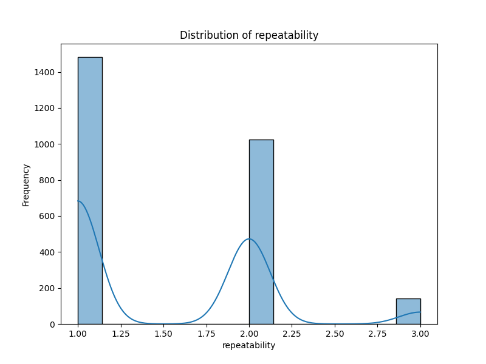

# Dataset Analysis

## Summary
### Analysis of the Dataset

Based on the provided summary statistics and the information about missing values, we can draw several insights about the data collected. Here’s a breakdown of the analysis:

#### Summary Statistics Analysis:

1. **Overall Ratings**:
   - The mean overall rating is approximately **3.05**, with a standard deviation of **0.76**, suggesting that while most ratings hover around the middle of the scale, there is some variability. 
   - A notable observation is that 75% of ratings are **3.0 or lower**, indicating a tendency towards moderate evaluations but an impactful percentage expressed lower ratings (1-2).
   - The minimum overall rating is **1.0**, while the maximum is **5.0**, suggesting possible dissatisfaction among a segment of respondents.

2. **Quality Ratings**:
   - The average quality rating of **3.21** also suggests that the respondents are generally neutral to slightly positive about quality, with 75% of the scores being **4.0 or lower** indicating that while there’s a slight skew towards quality being viewed better than average, it does not significantly exceed the median.
   - The higher mean quality rating compared to overall ratings suggests that while the quality is perceived as acceptable or good, the overall experience rated could be influenced by other factors beyond quality.

3. **Repeatability Ratings**:
   - The mean repeatability rating of approximately **1.49** indicates a marked tendency towards lower scores, with about **50%** of data at **1.0** which could imply that many respondents do not find enough value to repeatedly engage or utilize the subject matter in view.
   - This rating has the lowest mean compared to overall and quality, signaling a potential issue in user engagement or satisfaction that could deter repeat usage or loyalty.

#### Missing Values Analysis:
- The dataset shows a significant number of missing values for the **'date'** (99) and **'by'** (262) fields. 
   - The missing date entries could affect time-based analysis (trends, seasonality, and changes over time). Missing values could lead to biases if the distribution of missing dates is not random.
   - The large number of missing entries for 'by' (likely denoting the author or contributor) may indicate issues with accountability or acknowledgment of contribution, which might affect the perception of authority and trustworthiness in the dataset. 

### Insights and Implications:

- **Quality vs. Overall Experience**: The discrepancy between quality and overall ratings highlights that factors affecting overall satisfaction might extend beyond perceived quality. This warrants further investigation into additional aspects such as customer service, pricing, user experience, or product/service expectations.

- **Understanding Repeatability**: A mean repeatability rating less than 2 indicates that efforts should be made to enhance user satisfaction and loyalty. This could involve soliciting feedback from users on how their experiences could be improved, effectively addressing concerns raised during their interactions, and offering incentives for repeat engagement.

- **Identifying Trends Over Time**: The missing values in the 'date' column may limit the ability to frame a temporal analysis. If any advantageous trends appear, addressing the missing values is crucial for enabling deeper insights into the dataset. Investigating causes and finding a way to fill or estimate these missing dates accurately could unveil patterns over time.

- **Improving Author Trust**: The missing values in the 'by' column suggest the need for clearer attribution of content. Ensuring contributors are identified can enhance trust and transparency with users, potentially improving both the overall and repeatability scores.

### Storytelling Aspect:
The analysis can be framed into a story about a brand's journey to enhancing customer relationships and product experience. Despite generally positive feedback on the quality of the product/service offered, there's an underlying concern with customer satisfaction influencing repeat engagement negatively. The brand must focus on understanding the nuances of customer needs and addressing concerns that could transform a merely acceptable experience into a memorable one. By honing in on attribution and responsiveness to feedback, the brand can strive towards a transformation that not only bodes well for overall and quality ratings but also significantly impacts customer loyalty and engagement in an increasingly competitive landscape.

## Visualizations

