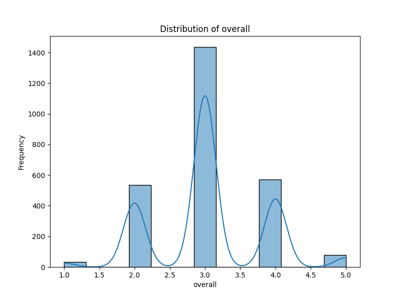
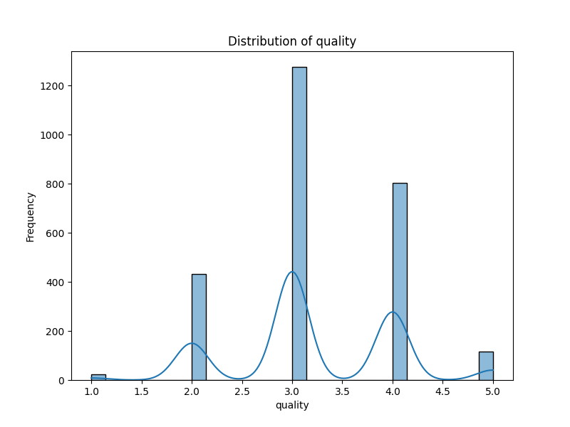

# Dataset Analysis

## Summary
Based on the provided dataset summary statistics and missing values, we can glean several insights and implications regarding the dataset, which appears to consist of reviews or assessments across various categories.

### Summary Insights

1. **Overall Ratings**:
   - The average score for the `overall` rating is approximately 3.05, which suggests a mild level of satisfaction or quality perception among respondents. The small standard deviation (0.76) indicates that most ratings are closely clustered around this mean.
   - There is an equal distribution of ratings, with 75% of ratings at or below 3, demonstrating a potential ceiling effect where most reviews trend towards mid-range scores.
   - The minimum score is `1` (indicating dissatisfaction) and the maximum is `5` (indicating high satisfaction); thus, any implications should consider both extremes.

2. **Quality Ratings**:
   - The average `quality` score (3.21) is slightly higher than the overall score, suggesting that quality is perceived more favorably than overall satisfaction. Additionally, the increase in average explains the 25% of scores in the quality category that are 4 or higher.
   - As with overall ratings, the quality ratings also show a clustering effect which suggests that improvements may be highly concentrated among lower-rated items, indicating room for quality enhancement.

3. **Repeatability Ratings**:
   - The repeatability rating has an average of 1.49, with a mode at 1. This score suggests a concerning level of dissatisfaction or concern regarding repeatability in the dataset. The low scores signify that users likely find it challenging to achieve consistent results with whatever is being assessed.
   - This also coincides with a higher standard deviation (0.60), indicating varied opinions on repeatability; some may rate it a 2 or 3, but a significant number stick to a 1.

4. **Missing Values**:
   - The missing data for `date` (99 missing entries) and `by` (262 missing entries) could represent a potential bias in analysis. Notably, the absence of the `by` column may skew insights into who provided the assessments, potentially omitting key contextual information about the reviewers' backgrounds and experiences.

### Insights and Implications

1. **Focus on Quality Improvement**:
   - Despite the overall average ratings being moderate, the somewhat higher quality rating implies that respondents value quality. This area might represent an opportunity for targeted initiatives to enhance service or product quality, thereby potentially improving overall satisfaction.

2. **State of Repeatability**:
   - The starkly low repeatability ratings may indicate systemic issues that need addressing. If users feel results are inconsistent or unreliable, it could negatively impact long-term engagement. Organizations may need to investigate the causes of lower repeatability scores, possibly through user feedback or analysis of operational processes, to ensure consistency in output.

3. **Handling Missing Data**:
   - The missing values in `date` and `by` columns could indicate issues with data collection or entry. An organized effort should be made to understand why these values are missing—this may involve enhancing data collection protocols or systems to minimize future occurrences. 

4. **Market Segmentation**:
   - Since `language` and `type` do not have missing values, a detailed analysis of these categories could yield insights into audience segments that are satisfied or dissatisfied based on the type of content or the language preferences. This could inform tailored improvements, marketing strategies, or diversification of offerings based on community needs.

5. **Continued Monitoring**:
   - Regular updates of these statistics will help track progress over time. By establishing baseline and target objectives for each metric, organizations can foster accountability and performance improvement.

In conclusion, the dataset reflects a mixed perception amongst users—while the overall quality is hovering around satisfactory levels, significant gaps in repeatability signal areas in dire need of improvement. Engaging with the dataset thoughtfully and strategically focusing on these key areas can lead to better customer satisfaction, loyalty, and service or product quality over time.

## Visualizations

